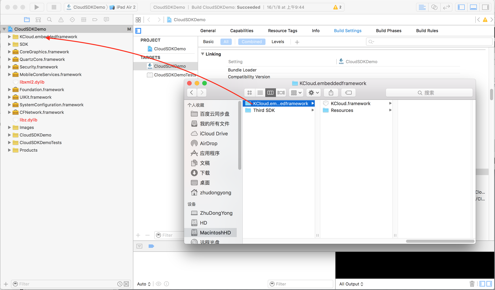
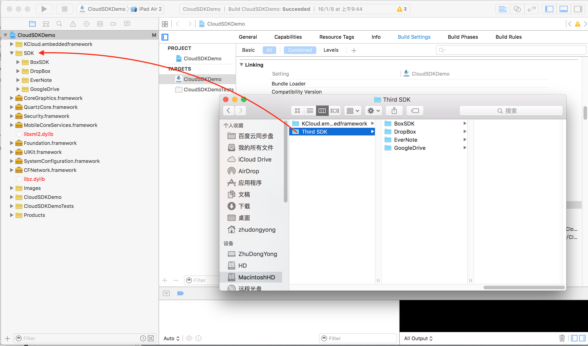
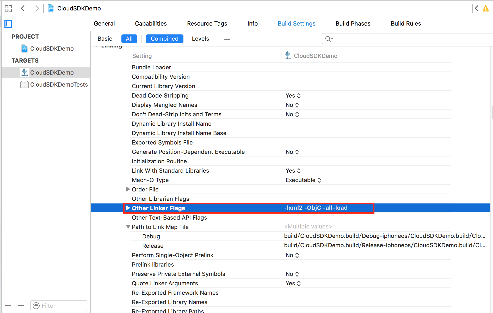

#&nbsp;&nbsp;&nbsp;&nbsp;&nbsp;&nbsp;&nbsp;&nbsp;&nbsp;&nbsp;&nbsp;&nbsp;&nbsp;&nbsp;&nbsp;&nbsp;&nbsp;&nbsp;KCloud SDK 集成指南

##一、创建Project
&nbsp;&nbsp;&nbsp;&nbsp;&nbsp;&nbsp;&nbsp;&nbsp;&nbsp;&nbsp;详情，请[点击](http://www.cnblogs.com/CocoonJin/p/5151065.html).

##二、导入KCloud.framework
&nbsp;&nbsp;&nbsp;&nbsp;&nbsp;&nbsp;&nbsp;&nbsp;&nbsp;&nbsp;将KCloud.framework拖入到`Step 1` 创建的Project中，如下图

##三、导入第三方SDK

##四、添加系统支持库
 
 	- CoreGraphics.framework
 	- QuartzCore.framework
 	- Security.framework
 	- MobileCoreServices.framework
 	- Foundation.framework
 	- UIKit.framework
 	- SystemConfiguration.framework
 	- CFNetwork.framework
 	
	- libz.dylib
 	- libxml2.dylib
 	
##五、编译参数
&nbsp;&nbsp;&nbsp;&nbsp;&nbsp;&nbsp;&nbsp;&nbsp;&nbsp;&nbsp;在**Other Linker Flags** 对应参数设置 **-lxml2 -ObjC -all-load**
如下图

 	
##六、代码集成
###Step 1： 头文件包含
	- #import <KCloud/KCloud.h>
	

###Step 2:各平台Key配置
	- (BOOL)application:(UIApplication *)application didFinishLaunchingWithOptions:(NSDictionary *)launchOptions
	{
    	//Config CloudStorage
    	CSCloudServerConfigurator *config = [CSCloudServerConfigurator defaultConfig];
    	//Box
    	config.boxClientID          = @“<your box client id>";
    	config.boxClientSecret      = @“<your box client secret>";
		//DropBox
    	config.dropboxCosumerKey    = @“<your dropbox consumer key>";
    	config.dropboxCosumerSecret = @"<your dropbox consumer secret>";
    	//Google Driver
    	config.googleDriverClientID = @“<your google driver client id>";
    	config.googleDriverClientSecret = @"<your google driver client secret>";
    	config.googleDriverKeyChainItemName = @“<your google driver keychain item name>";
    	//Evernote
    	config.evernoteAccessKey    = @“<your evernote access key>";
    	config.evernoteSecret       = @"<your evernote secret>";
    	//SugarSync
    	config.sugarSyncAppID       = @“<your sugar sync app id>";
    	config.sugarSyncAccessKey   = @“<your sugar sync access key>";
    	config.sugarSyncPrivateAccessKey = @"<your sugar sync private access key>";
    	//OneDrive/SkyDrive
    	config.oneDriveClientID     = @"<your one drive client id>";
    	//Support file types
    	config.supportFileTypes     = [CSCloudServerConfigurator allFileTypes];
    	//path
    	config.downloadFileSavePath = [NSHomeDirectory() stringByAppendingPathComponent:@"Documents"];
    	config.chooseUploadFilesPath= [NSHomeDirectory() stringByAppendingPathComponent:@"Documents"];
	
    	//App 初始化代码
    	//...
    	//

    	return YES;
	}
	
###Step 3:Hander URL
	- (BOOL)application:(UIApplication *)application openURL:(NSURL *)url sourceApplication:(NSString *)sourceApplication annotation:(id)annotation
	{
		BOOL result = [CSCloudServer openURL:url];
		if (result) {
			return YES;
		}
		
		//...
		
    	return YES;
	}
	
###Step 4:保存任务列表数据
	- (void)applicationDidEnterBackground:(UIApplication *)application {
    	[[CSDownloadManager sharedManager] saveDownloadTask];
		//...
	}
	
##七、方法调用
###1、各Cloud平台初始化
	+ (id)cloudServerForType:(CSCloudServerType)type;
	
参数'type'对应有
	
    CSDropbox 		DropBox平台
    CSGoogleDrive  GoogleDrive平台
    CSEvernote     EverNote平台
    CSFTP          FTP平台
    CSWebDav       WebDav平台
    CSMyDisk       MyDisk平台
    CSSugarSync    SugarSync平台
    CSBox          Box平台
    CSSkyDrive     OneDrive平台
    CSICloud       iCloud平台
    
###2、登录
	- (void)loginFromController:(UIViewController *)fromController;

回调

	- (void)serverLoginSuccess:(CSCloudServer *)server;
	- (void)serverLoginFaile:(CSCloudServer *)server withError:(NSError *)error;

###3、登出

	- (void)logout;
回调

	- (void)serverLogoutSuccess:(CSCloudServer *)server;
	- (void)serverLogoutFaile:(CSCloudServer *)server withError:(NSError *)error;

###4、获取指定目录文件和文件夹
	
	- (void)getListAndFolderByFoler:(CloudFile *)sourceFolder;
	获取根目录可用
	- (void)getRootListAndFolder;
	
回调

	- (void)serverGetListAndFolderSuccess:(CSCloudServer *)server folder:(NSArray *)folder andFile:(NSArray *)fileArr;
	- (void)serverGetLisAndFolderFaile:(CSCloudServer *)server withError:(NSError *)error;

###4.1、文件&文件夹排序
	//NSArray 类别方法
	- (NSArray*)sortByType:(CloudSortType)type;
	
	//排序方式
    CloudSortTypeCreateTime, //按创建时间排序
    CloudSortTypeModifyTime, //按修改时间排序
    CloudSortTypeAuthor,     //按作者名称排序
    CloudSortTypeFileName,   //按文件名称排序
    CloudSortTypeFileSize,   //文件大小

###5、下载文件
	- (void)downloadFile:(CloudFile *)file toPath:(NSString *)savePath;
回调

	- (void)serverDownloadSuccess:(CSCloudServer *)server;
	- (void)serverDownloadFaile:(CSCloudServer *)server withError:(NSError *)error;

###6、上传文件
	- (void)uploadFilePath:(NSString *)filePath toFolder:(CloudFile *)desFolder;

回调

	- (void)serverUploadFileSuccess:(CSCloudServer *)server;
	- (void)serverUploadFaile:(CSCloudServer *)server withError:(NSError *)error;

###7、添加到任务列表
	检测是否支持该功能
	- (BOOL)canAddToFileList;
	
	方法调用
	- (void)addToDownloadList:(CloudFile *)file withSavePath:(NSString *)path;

	回调
	- (void)serverAddToDownloadListSuccess:(CSCloudServer *)server;
	- (void)serverAddToDownloadFaile:(CSCloudServer *)server withError:(NSError *)error;

*NOTE:不支持的功能，调用会没有架调。*

###8、文件(夹)删除
	检测是否支持文件或文件夹删除功能
	
	- (BOOL)canDeleteFile;
	
	- (BOOL)canDeleteFolder;

	方法调用
	- (void)deleteFile:(CloudFile *)file;
	
	回调
	- (void)serverDeleteFileSuccess:(CSCloudServer *)server;
	- (void)serverDeleteFileFaile:(CSCloudServer *)server withError:(NSError *)error;

###9、创建文件夹
	功能检测
	- (BOOL)canCreateFolder;
	
	方法调用 
	- (void)createNewFolder:(NSString *)folderName inFolder:(CloudFile *)desFolder;
	
	回调
	- (void)serverCreatFolderSuccess:(CSCloudServer *)server;
	- (void)serverCreatFolderFaile:(CSCloudServer *)server withError:(NSError *)error;

*NOTE:如果是在根目录创建文件夹，'desFolder' 传nil即可。*

###10、重命名文件或文件夹
	功能检测
	- (BOOL)canRename;
	
	方法调用 
	- (void)renameFile:(CloudFile *)file withName:(NSString *)newName ;
	
	回调
	- (void)serverRenameSuccess:(CSCloudServer *)server;
	- (void)serverRenameFaile:(CSCloudServer *)server withError:(NSError *)error;
	
